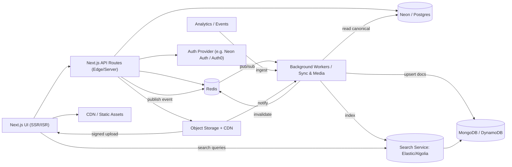

# Application Architecture Proposal — v0.1.0 (2025-10-26)

Purpose
- Propose an application-level architecture for Ubika (Next.js frontend + API + workers) that complements the hybrid data model (SQL canonical + NoSQL read store + Redis cache).
- Focus on common real-estate product use cases, scalability, resilience and maintainability.

Summary of goals
- Keep Next.js as the core web framework for server-side rendering (SSR), API routes, and front-end SPA behavior.
- Provide clear separation between request-time services (Next.js pages, API routes), background sync/processing (workers), and long-running services (search, analytics).
- Implement an event-driven sync pipeline that ensures SQL changes propagate to NoSQL and caches are invalidated.

1) Primary use cases (derived from hybrid data model)
- Browse listings (search, faceted filters, pagination)
- View listing details (images, highlights, neighborhood info)
- Create / edit listing (sellers / admin)
- Upload and manage images/media
- Save/favorite listings and view user saved lists
- Schedule tours / contact agents
- Realtime-ish updates (listings status/price changes) and notifications
- Analytics and activity capture (impressions, clicks, saves)

2) High-level architecture components
- Next.js (App): pages, server-side rendering (SSR), static generation (ISR), and API routes for small transactional operations.
- API Gateway / Edge: Next.js deployed on Vercel/Cloud Run/AWS App Runner with edge caching (CDN) for public pages and assets.
- SQL (Neon/Postgres): canonical data, transactional operations, user/auth data (if not delegated to auth provider).
- NoSQL (MongoDB/DynamoDB): denormalized property documents for fast read/query and search service input.
- Redis: cache, pub/sub, rate limit, counters, session store.
- Sync Worker(s): background worker(s) (Node.js/TypeScript) consuming Redis pub/sub or durable event log, responsible for building denormalized docs and invalidating caches.
- Search Service: dedicated search/indexing service (Algolia/Elasticsearch/OpenSearch or custom service reading NoSQL) for fast full-text and geo queries.
- Media service / CDN: object storage (S3 or Vercel Blob) + CDN for images; signed upload flows for clients.
- Notification worker / scheduler: handles email / push / SMS for scheduled tours, price changes.
- Observability: centralized logs, metrics (Prometheus), traces (OpenTelemetry), and health checks.

3) Data & flow patterns (short)
- Write flow (Create/Edit listing): Next.js API → SQL transaction → publish event (Redis or events table) → Sync worker reads SQL and upserts NoSQL → invalidate Redis keys → Search service updates index.
- Read flow (Listing page): Next.js SSR / client reads Redis → if miss, read NoSQL (denormalized doc) → fallback SQL for last-resort data. Search queries hit Search Service which reads NoSQL or its own index.
- Media upload: Client uploads to temporary signed URL (S3/Vercel Blob) → background job processes images (resize/webp) → stores media metadata in SQL → publishes event to sync workers to update NoSQL.

4) Mermaid diagram (application-level)

5) Component responsibilities (short bullets)
- Next.js UI
  - Provide SSR for SEO-critical listing pages and ISR for near-real-time updates.
  - Use API routes for transactional user actions (create listing, save listing) with server-side validation and DB writes.
  - Client code fetches denormalized docs for fast render; falls back to API when needed.

- API Routes
  - Thin transactional layer — validate input, perform SQL transactions, emit events.
  - Return final canonical ids and basic denormalized payloads for immediate UX.

- Sync Worker(s)
  - Subscribe to `events:property_changes` (Redis) or poll durable events table.
  - Build/patch NoSQL property documents (partial updates), update search index and invalidate caches.
  - Run media processing tasks (thumbnail generation, sizes) or delegate to specialized worker.

- Search Service
  - Maintain a fast queryable index (full-text & geo). Either a hosted provider (Algolia) or self-managed Elastic/OpenSearch.
  - Ingest changes from workers or from change-streams on NoSQL.

- Media Service
  - Provide signed upload endpoints and process images in workers.
  - Store URLs/keys in SQL and reference in NoSQL docs.

- Redis
  - Short-term cache for documents and search results.
  - Pub/sub channel for low-latency invalidation.
  - Rate-limiting and session helpers.

6) Scaling & deployment notes
- Deploy Next.js on Vercel or equivalent for global edge SSR; use ISR for frequently-updated pages with revalidation hooks triggered by workers.
- Workers: horizontally scalable containerized services (Kubernetes, ECS, or serverless functions with durable queue). Aim for idempotent processing and small batches.
- Use managed Neon for Postgres and managed MongoDB/DynamoDB for NoSQL. Use Redis managed (e.g., Redis Cloud) with persistence and HA.
- Search: prefer managed search for faster time-to-market (Algolia or Elastic Cloud).

7) Reliability & consistency trade-offs
- Favor eventual consistency for listing reads to keep low latency; make critical operations (booking, scheduling) synchronous and transactional in SQL.
- Implement an events table in SQL for durable change logs to recover from missed pub/sub messages.
- Add `sync_version` / `updated_at` fields to detect and reconcile stale NoSQL writes.

8) Security & operational items
- All DB credentials in environment management (Vercel secrets / Vault). Avoid embedding secrets in repo.
- Use signed uploads for media and restrict write access to storage keys.
- Harden API routes with rate limits and user auth (JWT or session via Auth provider).
- Add observability: request traces, worker lag metrics, metrics for cache hit/miss, and SLOs for search freshness.

9) Next steps (practical)
- Implement `events` table and add a small `sync-worker` PoC that subscribes to Redis and upserts to NoSQL.
- Add a `revalidate` API route (Next.js) that workers can call to trigger ISR revalidation for affected pages.
- Create a small diagram-driven runbook for cache invalidation and full re-sync.

Document created: v0.1.0 — 2025-10-26
